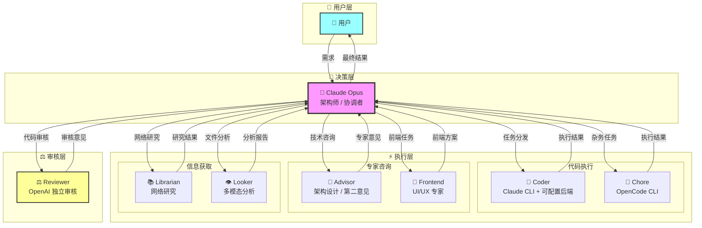
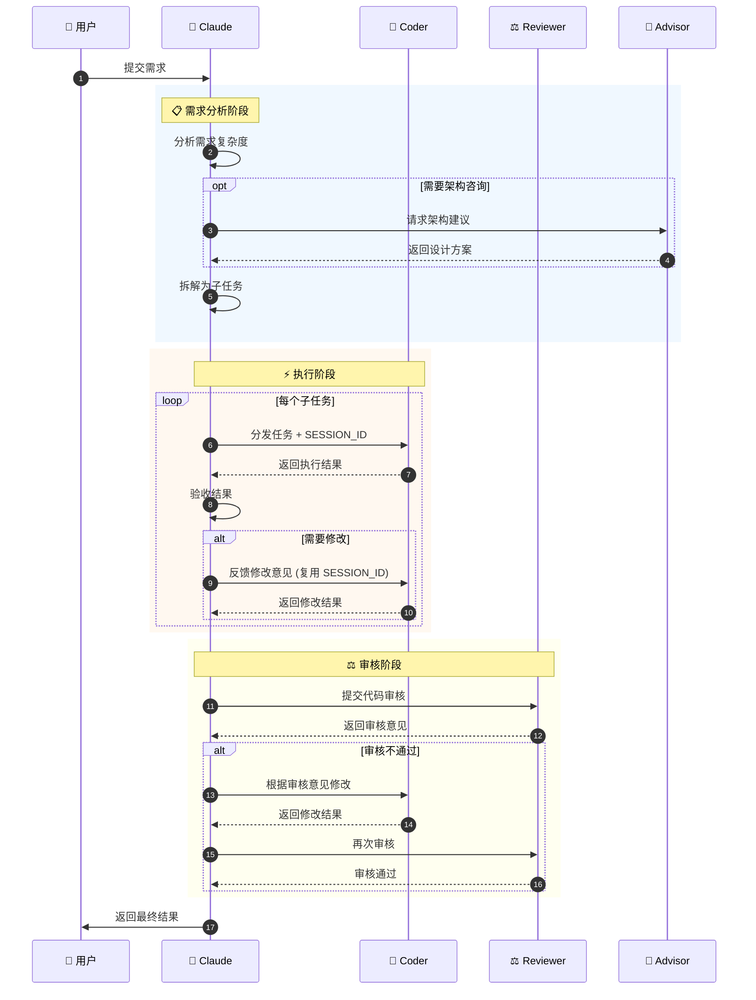

[](https://mseep.ai/app/lynricsy-oh-my-claudecode)

# Oh-My-ClaudeCode (OMCC)

<div align="center">


[English](README_EN.md)

**Claude 多代理协作 MCP 服务器**

让 **Claude** 作为架构师调度多个专业代理执行各类任务，形成**自动化的多方协作闭环**。

[快速开始](#-快速开始) • [工具详解](#-工具详解) • [配置说明](#-配置说明)

</div>

---

## 🌟 核心价值

| 维度 | 说明 |
| :--- | :--- |
| **🧠 成本优化** | Claude 负责思考与调度（贵但强），Coder 负责代码执行（量大管饱） |
| **🧩 能力互补** | Claude 补足 Coder 创造力短板，Reviewer 提供独立审核视角，Advisor 提供多元化专家意见 |
| **🛡️ 质量保障** | 双重审核机制：Claude 初审 + Reviewer 终审 |
| **🔄 全自动闭环** | 拆解 → 执行 → 审核 → 重试，最大程度减少人工干预 |
| **🔗 上下文保持** | SESSION_ID 会话复用机制确保多轮协作上下文连贯 |
| **📚 专业分工** | Frontend 专注 UI/UX、Librarian 专注网络研究、Looker 专注多模态分析 |

## 🤖 角色分工

| 角色 | 工具 | 后端 | 定位 |
|------|------|------|------|
| 👑 **架构师** | Claude | - | 需求分析、任务拆解、最终决策 |
| 🔨 **执行者** | `coder` | Claude CLI + 可配置后端 | 代码生成、修改、批量任务 |
| ⚖️ **审核官** | `reviewer` | Codex CLI (OpenAI) | 独立代码审核、架构咨询 |
| 🧠 **专家顾问** | `advisor` | OpenCode CLI | 架构设计、第二意见 |
| 🎨 **前端专家** | `frontend` | OpenCode CLI | 界面设计、样式、动效 |
| 🔧 **杂务执行** | `chore` | OpenCode CLI | 批量重命名、格式化等 |
| 📚 **网络研究** | `librarian` | OpenCode CLI | 文档查询 + 网络搜索 + 代码搜索 |
| 👁️ **多模态分析** | `looker` | Gemini API | PDF、图片、视频、音频分析 |

### 系统架构



### 协作流程



## 🚀 快速开始

### 前置要求

| 工具 | 版本要求 | 用途 |
|------|----------|------|
| [uv](https://docs.astral.sh/uv/) | - | Python 包管理器 |
| [Claude Code](https://claude.ai/code) | ≥ v2.0.56 | 主框架 |
| [Codex CLI](https://developers.openai.com/codex/quickstart) | ≥ v0.61.0 | 代码审核 |
| [OpenCode](https://opencode.ai) | 推荐 | 专家咨询/前端/网络研究/多模态/杂务 |

### ⚡ 一键安装

**macOS/Linux**
```bash
git clone https://github.com/Lynricsy/Oh-My-ClaudeCode.git
cd Oh-My-ClaudeCode
chmod +x setup.sh && ./setup.sh

# 更新已有安装（跳过交互式配置）
./setup.sh --update
```

**Windows**
```powershell
git clone https://github.com/Lynricsy/Oh-My-ClaudeCode.git
cd Oh-My-ClaudeCode
.\setup.bat
```

脚本将自动完成：安装依赖 → 注册 MCP → 安装 Skills → 配置全局 Prompt → 配置 Coder

### 手动安装

```bash
# 1. 安装 MCP 服务器
claude mcp add omcc -s user --transport stdio -- \
  uvx --refresh --from git+https://github.com/Lynricsy/Oh-My-ClaudeCode.git omcc-mcp

# 2. 创建配置文件
mkdir -p ~/.omcc-mcp
cp config.example.toml ~/.omcc-mcp/config.toml
# 编辑 ~/.omcc-mcp/config.toml 填入你的 API Token

# 3. 验证安装
claude mcp list
# 应显示: omcc: ... - ✓ Connected
```

### 卸载

```bash
claude mcp remove omcc -s user
```

## 🛠️ 工具详解

### `coder` - 代码执行者

调用可配置后端执行代码生成或修改任务。

| 参数 | 类型 | 必填 | 默认值 | 说明 |
|------|------|:----:|--------|------|
| `PROMPT` | string | ✅ | - | 任务指令 |
| `cd` | Path | ✅ | - | 工作目录 |
| `sandbox` | string | | `workspace-write` | 沙箱策略 |
| `SESSION_ID` | string | | `""` | 会话 ID（多轮对话） |
| `timeout` | int | | `300` | 空闲超时（秒） |
| `max_duration` | int | | `1800` | 总时长上限（秒） |
| `max_retries` | int | | `0` | 最大重试次数 |
| `return_metrics` | bool | | `false` | 返回性能指标 |

### `reviewer` - 代码审核官

调用 Codex CLI 进行独立代码审查。

| 参数 | 类型 | 必填 | 默认值 | 说明 |
|------|------|:----:|--------|------|
| `PROMPT` | string | ✅ | - | 审核任务描述 |
| `cd` | Path | ✅ | - | 工作目录 |
| `sandbox` | string | | `read-only` | 沙箱策略（强制只读） |
| `SESSION_ID` | string | | `""` | 会话 ID |
| `image` | List[Path] | | `[]` | 附加图片（UI 审查） |
| `model` | string | | `""` | 指定模型 |
| `timeout` | int | | `300` | 空闲超时（秒） |
| `max_retries` | int | | `1` | 最大重试次数 |

### `advisor` - 多面手专家

调用 OpenCode CLI 进行技术咨询或代码执行。

| 参数 | 类型 | 必填 | 默认值 | 说明 |
|------|------|:----:|--------|------|
| `PROMPT` | string | ✅ | - | 任务指令 |
| `cd` | Path | ✅ | - | 工作目录 |
| `sandbox` | string | | `workspace-write` | 沙箱策略 |
| `SESSION_ID` | string | | `""` | 会话 ID |
| `model` | string | | 配置值 | 指定模型（provider/model 格式） |
| `timeout` | int | | `300` | 空闲超时（秒） |
| `max_duration` | int | | `3600` | 总时长上限（秒） |
| `max_retries` | int | | `1` | 最大重试次数 |

### `frontend` - 前端/UI 专家

调用 OpenCode CLI 进行专业前端开发。

| 参数 | 类型 | 必填 | 默认值 | 说明 |
|------|------|:----:|--------|------|
| `PROMPT` | string | ✅ | - | 前端/UI 任务描述 |
| `cd` | Path | ✅ | - | 工作目录 |
| `sandbox` | string | | `workspace-write` | 沙箱策略 |
| `SESSION_ID` | string | | `""` | 会话 ID |
| `timeout` | int | | `180` | 空闲超时（秒） |
| `max_duration` | int | | `3600` | 总时长上限（秒） |
| `max_retries` | int | | `1` | 最大重试次数 |

**支持技术栈**: React / Vue / Svelte / HTML+Tailwind

### `chore` - 杂务执行者

调用 OpenCode CLI 执行简单重复任务。

| 参数 | 类型 | 必填 | 默认值 | 说明 |
|------|------|:----:|--------|------|
| `PROMPT` | string | ✅ | - | 杂务任务描述 |
| `cd` | Path | ✅ | - | 工作目录 |
| `sandbox` | string | | `workspace-write` | 沙箱策略 |
| `SESSION_ID` | string | | `""` | 会话 ID |
| `timeout` | int | | `120` | 空闲超时（秒） |
| `max_duration` | int | | `3600` | 总时长上限（秒） |
| `max_retries` | int | | `0` | 最大重试次数 |

**适用场景**: 批量重命名、全局替换、格式化、依赖更新

### `librarian` - 网络研究专家

调用 OpenCode CLI 进行网络研究（文档查询、网络搜索、代码搜索等）。

| 参数 | 类型 | 必填 | 默认值 | 说明 |
|------|------|:----:|--------|------|
| `PROMPT` | string | ✅ | - | 网络研究任务描述 |
| `cd` | Path | ✅ | - | 工作目录 |
| `sandbox` | string | | `read-only` | 沙箱策略（只读） |
| `SESSION_ID` | string | | `""` | 会话 ID |
| `timeout` | int | | `120` | 空闲超时（秒） |
| `max_duration` | int | | `3600` | 总时长上限（秒） |
| `max_retries` | int | | `1` | 最大重试次数 |

**研究能力**（通过 OpenCode CLI 配置的 MCP）：
- `context7`: 官方文档查询
- `exa`: 网络搜索
- `Playwright`: 浏览器自动化（JS 渲染页面）
- `grep`: 代码搜索（grep.app 开源代码搜索）
- `firecrawl`: 网页内容抓取

**注意**: 本地代码搜索请使用 Claude 的 Explore 代理

### `looker` - 多模态分析专家

直接调用 Gemini API 分析媒体文件。

| 参数 | 类型 | 必填 | 默认值 | 说明 |
|------|------|:----:|--------|------|
| `file_path` | string | ✅ | - | 媒体文件路径 |
| `goal` | string | ✅ | - | 分析目标 |
| `cd` | Path | ✅ | - | 工作目录 |
| `sandbox` | string | | `read-only` | 沙箱策略（只读） |
| `SESSION_ID` | string | | `""` | 会话 ID |
| `timeout` | int | | `120` | API 超时（秒） |
| `max_retries` | int | | `1` | 最大重试次数 |

**分析能力**: PDF、图片、视频、音频、图表、架构图、截图

**支持格式**:
- 图片: .jpg, .jpeg, .png, .gif, .webp, .bmp
- PDF: .pdf
- 视频: .mp4, .mpeg, .mov, .avi, .webm, .mkv, .flv, .wmv, .3gp
- 音频: .mp3, .wav, .aac, .ogg, .flac, .m4a, .wma

**文件大小限制**: 20MB

**⚠️ 重要限制**:
- Looker **无法调用任何 MCP 工具**
- Looker **只能分析指定的单个文件**
- 如需分析多个文件，需分别调用

### 沙箱策略

| 值 | 说明 |
|----|------|
| `read-only` | 只读，不允许修改文件 |
| `workspace-write` | 允许写入工作目录 |
| `danger-full-access` | 完全访问（慎用） |

### 返回值结构

```json
{
  "success": true,
  "tool": "coder",
  "SESSION_ID": "uuid-string",
  "result": "执行结果",
  "duration": "1m30s"
}
```

**错误返回**:
```json
{
  "success": false,
  "tool": "coder",
  "error": "错误摘要",
  "error_kind": "idle_timeout | upstream_error | ...",
  "error_detail": {
    "message": "详细信息",
    "exit_code": 1,
    "last_lines": ["最后输出..."]
  }
}
```

## ⚙️ 配置说明

配置文件位置: `~/.omcc-mcp/config.toml`

```toml
# Coder 配置（Claude CLI + 可配置后端）
[coder]
api_token = "your-api-token"  # 必填
base_url = "https://open.bigmodel.cn/api/anthropic"  # 示例：GLM API
model = "glm-4.7"  # 默认模型
extended_context = false  # 是否启用 1m 扩展上下文（通过 [1m] 后缀）

[coder.env]
CLAUDE_CODE_DISABLE_NONESSENTIAL_TRAFFIC = "1"

# OpenCode CLI 代理模型配置
# 模型格式为 provider/model，需要在 ~/.config/opencode/opencode.jsonc 中配置 provider
[advisor]
model = "google/gemini-3-pro-preview"

[frontend]
model = "google/gemini-3-pro-preview"

[librarian]
model = "google/gemini-3-flash-preview"

# Looker 多模态分析（直接调用 Gemini API）
[looker]
api_key = "your-gemini-api-key"  # 必填
base_url = "https://generativelanguage.googleapis.com"  # 可选
model = "gemini-3-flash-preview"  # 可选

# Chore 杂务代理
[chore]
model = "anthropic/claude-sonnet-4-20250514"
```

### Coder 配置项

| 配置项 | 类型 | 必填 | 默认值 | 说明 |
|--------|------|:----:|--------|------|
| `api_token` | string | ✅ | - | API Token |
| `base_url` | string | ✅ | - | API 地址（需支持 Claude Code API 协议） |
| `model` | string | | `glm-4.7` | 模型名称 |
| `extended_context` | bool | | `false` | 启用 1m 扩展上下文（自动添加 `[1m]` 后缀） |

> **💡 1m 扩展上下文**: 启用后模型名称会自动添加 `[1m]` 后缀（如 `glm-4.7[1m]`），以启用 Claude Code 的 1 百万 token 上下文窗口。需要后端模型支持此特性。

### 环境变量（仅 Coder）

| 变量 | 说明 |
|------|------|
| `CODER_API_TOKEN` | API Token |
| `CODER_BASE_URL` | API 地址 |
| `CODER_MODEL` | 模型名称 |

## 📚 架构说明

### 三层配置架构

| 层级 | 职责 | 必需性 |
|------|------|--------|
| **MCP 层** | 工具实现（类型安全、错误处理、重试） | **必需** |
| **Skills 层** | 工作流指导（何时/如何使用工具） | 推荐 |
| **全局 Prompt** | 强制规则（确保遵守协作流程） | 推荐 |

### Skills 安装

```bash
# macOS/Linux
mkdir -p ~/.claude/skills
cp -r skills/omcc-workflow ~/.claude/skills/
cp -r skills/advisor-collaboration ~/.claude/skills/
cp -r skills/frontend ~/.claude/skills/
cp -r skills/chore ~/.claude/skills/
cp -r skills/librarian ~/.claude/skills/
cp -r skills/looker ~/.claude/skills/

# Windows (PowerShell)
xcopy /E /I "skills\omcc-workflow" "$env:USERPROFILE\.claude\skills\omcc-workflow"
xcopy /E /I "skills\advisor-collaboration" "$env:USERPROFILE\.claude\skills\advisor-collaboration"
xcopy /E /I "skills\frontend" "$env:USERPROFILE\.claude\skills\frontend"
xcopy /E /I "skills\chore" "$env:USERPROFILE\.claude\skills\chore"
xcopy /E /I "skills\librarian" "$env:USERPROFILE\.claude\skills\librarian"
xcopy /E /I "skills\looker" "$env:USERPROFILE\.claude\skills\looker"
```

### 权限配置（可选）

在 `~/.claude/settings.json` 中添加自动授权:

```json
{
  "permissions": {
    "allow": [
      "mcp__omcc__coder",
      "mcp__omcc__reviewer",
      "mcp__omcc__advisor",
      "mcp__omcc__frontend",
      "mcp__omcc__chore",
      "mcp__omcc__librarian",
      "mcp__omcc__looker"
    ]
  }
}
```

## 🧑‍💻 开发

```bash
git clone https://github.com/Lynricsy/Oh-My-ClaudeCode.git
cd Oh-My-ClaudeCode
uv sync
uv run omcc-mcp
```

## 📚 参考资源

- [FastMCP](https://github.com/jlowin/fastmcp) - MCP 框架
- [Claude Code](https://docs.anthropic.com/en/docs/claude-code) - 主框架文档
- [Codex CLI](https://developers.openai.com/codex/quickstart) - 代码审核
- [OpenCode](https://opencode.ai) - 专家咨询/前端/网络研究/多模态
- [智谱 AI](https://open.bigmodel.cn) - GLM-4.7 推荐后端

## 🙏 致谢

- **[Coder-Reviewer-Advisor](https://github.com/FredericMN/Coder-Reviewer-Advisor)** - 本项目的核心灵感来源，提供了 Claude + Coder + Reviewer + Advisor 多模型协作的架构设计与实现参考
- **[Amp](https://ampcode.com/)** - Sourcegraph 开发的前沿 AI 编码代理，其终端优先的设计理念和代理式编码实践为本项目提供了宝贵启发

## 📄 License

MIT
